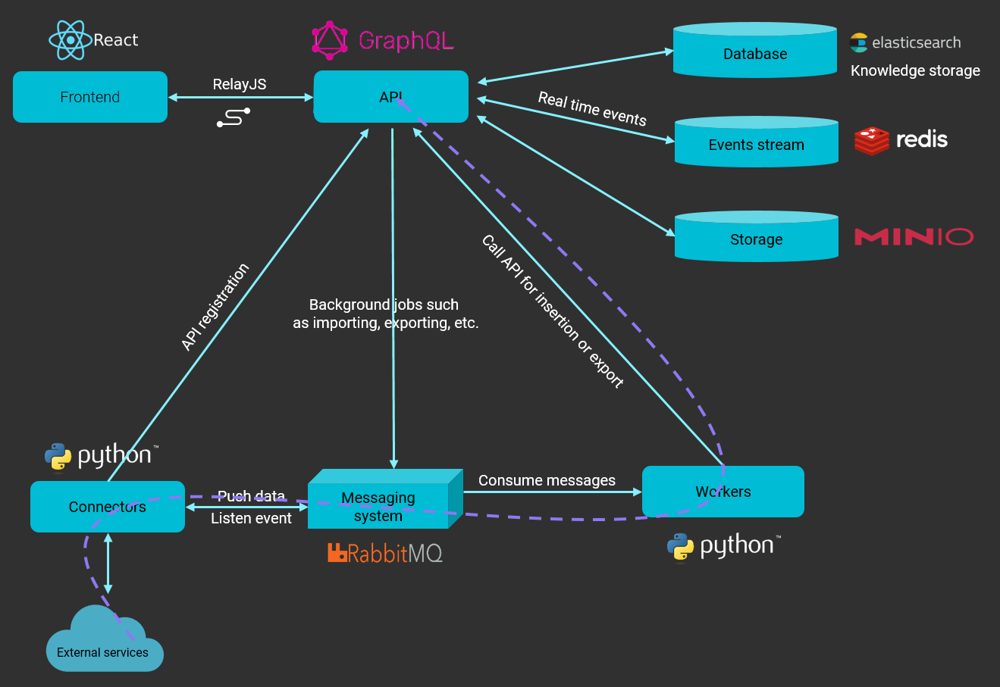
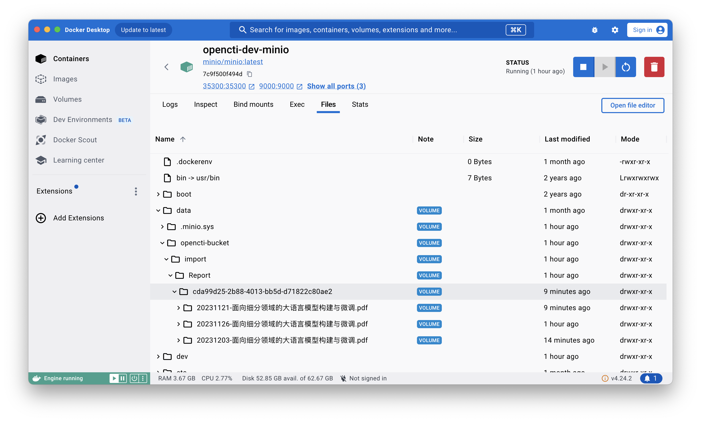
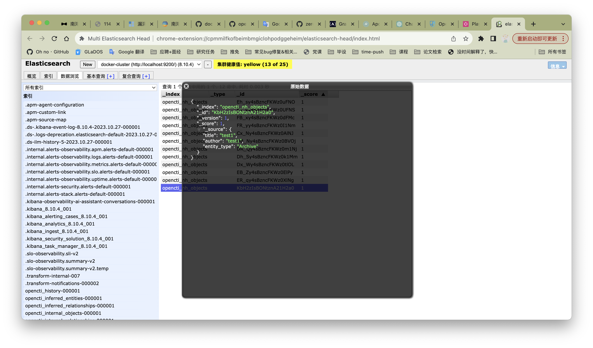

# 1. opencti-graphql

src/back.js负责启动整个后端，会调用platformStart方法，platformStart方法中会调用startModules方法，startModules方法会调用httpServer.start()方法，httpServer.start()方法会调用listenServer方法，listenServer方法会调用createHttpServer方法，createHttpServer方法会调用src/graphql/graphql.js中的createApolloServer方法

1. src/graphql/graphql.js中的createApolloServer方法用来创建graphql服务，调用src/graphql/schema.js中的createSchema来创建一个GraphQL模式，GraphQL模式（schema）是一个定义了GraphQL API的类型系统的核心部分。它描述了API提供的数据结构和可用的查询操作。 模式定义了可用的对象类型、字段、查询操作以及其他相关的元素。通过模式，客户端可以发出查询请求，并获取符合模式定义的数据。**相当于后端接口**。

2. src/graphql/schema.js中的createSchema方法会用到schemaResolvers，在GraphQL中，`schemaResolvers`是一个用于定义查询、变更（mutation）和订阅（subscription）解析器的对象。它们是GraphQL服务器的核心组成部分，用于处理客户端请求并返回相应的数据。

   `schemaResolvers`对象通常包含以下三个属性：

   - `Query`：用于处理查询请求的解析器。
   - `Mutation`：用于处理变更请求的解析器。
   - `Subscription`：用于处理订阅请求的解析器。

   每个属性都是一个包含多个字段解析器的对象。字段解析器是一个函数，用于处理特定字段的查询、变更或订阅请求，并返回相应的数据。通过定义适当的`schemaResolvers`，开发人员可以控制GraphQL服务器如何处理客户端请求并返回所需的数据。这使得GraphQL服务器可以根据需要进行数据的获取、修改和实时更新。

   具体的schemaResolvers在src/resolvers目录下。

3. 以src/resolvers/elasticSearchMetricsResolvers为例，在Query中调用了src/domain/searchMetrics中的getMetrics方法，getMetrics方法调用了src/database/engine中的getStats方法

4. src/database/engine.js初始化ElasticSearch，还有一些与es相关的操作

# 2. OpenCTI源码修改

## 2.1 文本数据上传

**参考链接：**

1. https://kylin.dev/2020/07/07/Apollo-GraphQL%E5%BF%AB%E9%80%9F%E4%B8%8A%E6%89%8B-%E6%9C%8D%E5%8A%A1%E7%AB%AF/
2. https://www.freecodecamp.org/chinese/news/a-detailed-guide-to-graphql/

经过对源码的分析，想要新增自定义接口来导入数据，重点需要关注**schemaResolvers**。可以以opencti-graphql/src/resolvers/report.js为例来进行学习怎么编写代码。

1. 添加opencti-graphql/src/resolvers/nh.js以及opencti-graphql/src/domain/nh.js

2. 在opencti-graphql/src/graphql/schema.js中添加对应的resolver

3. 加上resolver后还缺少schema

   

4. 终端运行`cnpm install apollo-server-koa koa`安装koa相关的依赖，在 opencti-graphql/src/graphql/schema.js中添加如下代码。

   ```js
   // 最终写法
   const archDefs = gql`
         type Arch {
           tm: String
           ym: String
           zzyuanm: String
           zzyim: String
           bzyuanm: String
           bzyim: String
           yzyuanm: String
           yzyim: String
           gjc: String
           lh1: String
           lh2: String
           lh3: String
           zwzy: String
           wwzy: String
           mc: String
           cb: String
           pf: String
           xltm: String
           fz: String
           zzjg: String
           cbd: String
           cbjg: String
           bc: String
           bh: String
           ysjg: String
           cbrq: String
           cjrq: String
           ysrq: String
           chrq: String
           fxrq: String
           isbn: String
           issn: String
           isrc: String
           csbh: String
           hf: String
           secai: String
           cc: String
           sc: String
           qsy: String
           gcd: String
           url: String
           hymc: String
           km: String
           qs: String
           yz: String
           dm: String
           gb: String
           xwmc: String
           xkzy: String
           ds: String
           xwsydw: String
           blc: String
           tkfw: String
           fbjg: String
           pzjg: String
           qt1: String
           qt2: String
           yema: String
           pdf: String
           txt: String
           bz: String
         }
         input ArchInput{
           tm: String
           ym: String
           zzyuanm: String
           zzyim: String
           bzyuanm: String
           bzyim: String
           yzyuanm: String
           yzyim: String
           gjc: String
           lh1: String
           lh2: String
           lh3: String
           zwzy: String
           wwzy: String
           mc: String
           cb: String
           pf: String
           xltm: String
           fz: String
           zzjg: String
           cbd: String
           cbjg: String
           bc: String
           bh: String
           ysjg: String
           cbrq: String
           cjrq: String
           ysrq: String
           chrq: String
           fxrq: String
           isbn: String
           issn: String
           isrc: String
           csbh: String
           hf: String
           secai: String
           cc: String
           sc: String
           qsy: String
           gcd: String
           url: String
           hymc: String
           km: String
           qs: String
           yz: String
           dm: String
           gb: String
           xwmc: String
           xkzy: String
           ds: String
           xwsydw: String
           blc: String
           tkfw: String
           fbjg: String
           pzjg: String
           qt1: String
           qt2: String
           yema: String
           pdf: String
           txt: String
           bz: String
         }
         type Query {
           arch(id:ID!): Arch
         }
         type Mutation {
           archAdd(input: ArchInput): Arch
         }
     `;
   ```

5. 修改opencti-graphql/src/resolvers/nh.js中addArch方法的实现为自定义实现，已经修改了一个版本，可以在代码中查看

6. 测试mutation请求时可以使用如下语句在 http://localhost:3000/graphql 中进行测试，可以成功将这条数据插入es，在Multi Elasticsearch Head中可以查询到对应的数据。

   ```js
   // 最终写法：
   mutation UpdateUser($input: ArchInput!) {
     archAdd(input: $input) {
       tm
       ym
       zzyuanm
       zzyim
       bzyuanm
       bzyim
     	yzyuanm
       yzyim
       gjc
       lh1
       lh2
       lh3
       zwzy
       wwzy
       mc
       cb
       pf
       xltm
       fz
       zzjg
       cbd
       cbjg
       bc
       bh
       ysjg
       cbrq
       cjrq
       ysrq
       chrq
       fxrq
       isbn
       issn
       isrc
       csbh
       hf
       secai
       cc
       sc
       qsy
       gcd
       url
       hymc
       km
     	qs
       yz
       dm
       gb
       xwmc
       xkzy
       ds
       xwsydw
       blc
       tkfw
       fbjg
       pzjg
       qt1
       qt2
       yema
       pdf
       txt
       bz
     }
   }
   // query variables
   {
     "input": {
      	"tm": "南海北部陆缘东部陆坡的蒸发盐沉积",
       "ym":"EXPLORATIONONTHEEVAPORATESEDIMENTINTHESLOPEOFTHENORTHERNMARGINOFTHESOUTHCHINASEA",
       "zzyuanm":"姚伯初",
       "zzyim":"YAOBochu",
       "bzyuanm":"",
       "bzyim":"",
     	"yzyuanm":"",
       "yzyim":"",
       "gjc":"南海北部陆缘东部陆坡;层速度;变形沉积;蒸发盐;海底扩张初始阶段沉积环境;大陆张裂;陆块分离;海底扩张;地震反射剖面",
       "lh1":"A0104",
       "lh2":"",
       "lh3":"",
       "zwzy":"在南海北部陆缘东部、台湾浅滩以南的陆坡上,海底水深1000～3000m,海底坡度较小,平均8.6×10-3。从穿过这里的地震剖面上看,新生代早期(晚渐新世)有一套沉积(T7—T8)发生过强烈变形,其内部无反射,只有杂乱的噪声。从地震声纳浮标探测的结果看,这套沉积的层速度为4.98km/s。由于这套沉积的变形,使上覆沉积也发生了变形。将这套沉积和大西洋边缘的蒸发盐沉积对比,发现其反射特征和层速度极为相似。因此,推测它为发生在海底扩张初期的蒸发盐沉积。",
       "wwzy":"　IntheeasternpartofthenorthernmarginoftheSouthChinaSea(fromtheslopetothesouthofTai-wanShoal),thewaterdepthoftheseaisvaryingfrom1000mto3000m,andthegradientoftheseaflooris8.6×10-3onanaverage.Fromtheseismicprofilescrossingtheslopewecanseethatthereareasetofintensivelydeformedsediments(T7-T8)whoseageislateOligocene.Andtherearenoreflectionsbutonlymixedinterferenceinitsinterior.Theintervalvelocityis4.98km/saccordingtothesonobuoymeasure-ment.TheoverlyingsedimentsaredeformedasintensivelyasthesedimentsofT7-T8.Comparingthesedi-mentswiththeevaporateontheAtlanticmarginswefoundthatthereflectioncharactersandintervalve-locityareverysimilar.Therefore,webelievethatthesedimentsofT7-T8maybeevaporateandwerede-positedintheinitialstageoftheseafloorspreading,thatis,thelateOligocene.",
       "mc":"",
       "cb":"",
       "pf":"",
       "xltm":"",
       "fz":"",
       "zzjg":"国土资源部 广州海洋地质调查局",
       "cbd":"",
       "cbjg":"",
       "bc":"",
       "bh":"",
       "ysjg":"",
       "cbrq":"",
       "cjrq":"",
       "ysrq":"",
       "chrq":"",
       "fxrq":"",
       "isbn":"",
       "issn":"",
       "isrc":"",
       "csbh":"",
       "hf":"",
       "secai":"",
       "cc":"",
       "sc":"",
       "qsy":"",
       "gcd":"",
       "url":"",
       "hymc":"",
       "km":"",
     	"qs":"",
       "yz":"中文",
       "dm":"",
       "gb":"",
       "xwmc":"",
       "xkzy":"",
       "ds":"",
       "xwsydw":"",
       "blc":"",
       "tkfw":"",
       "fbjg":"",
       "pzjg":"",
       "qt1":"",
       "qt2":"",
       "yema":"",
       "pdf":"",
       "txt":"",
       "bz":"测试使用"
     }
   }
   ```

7. 修改opencti-graphql/src/resolvers/nh.js中arch方法的实现为自定义实现，通过数据id查询数据的完整信息**[todo]**

8. 测试query请求时可以使用如下语句在 http://localhost:3000/graphql 中进行测试。

   ```bash
   query Arch {
     arch(id: "K7EJzYsBONtznA21h2Zn") {
       title
       author
     }
   }
   ```

## 2.2 文件上传

1. 文件上传调用的是src/database/file-storage.js下的upload方法。在opencti-platform/opencti-graphql/src/resolvers/stixCoreObject.js中使用了stixCoreObjectImportPush方法，该方法会调用upload方法来上传文件。
2. 上传后的文件会存储到minio S3存储桶中，也就是docker的minio镜像中的data/opencti-bucket/import/report目录下
3. 前端写的时候可以参照opencti-platform/opencti-front/src/private/components/common/files/FileUploader.tsx
4. 注意前端发送请求的时候和常规请求不太一样，可以参照 https://juejin.cn/s/node%20js%20graphql%20upload%20file 来写。目前实现了一个版本，在NH_Database/Kipso/api目录下。

# 3. 工具使用

## 3.1 利用postman发送graphql请求进行测试

请求网址：http://localhost:3000/graphql ，请求为post。

在[个人配置](http://localhost:3000/dashboard/profile/me)中找到api访问中的REQUIRED HEADERS，添加到postman的Headers中。

在Body中选择json格式的raw，填入浏览器中发送的请求的内容，例如：

```json
{"id":"ReportCreationMutation","query":"mutation ReportCreationMutation(\n  $input: ReportAddInput!\n) {\n  reportAdd(input: $input) {\n    id\n    standard_id\n    name\n    description\n    entity_type\n    parent_types\n    ...ReportLine_node\n  }\n}\n\nfragment ReportLine_node on Report {\n  id\n  entity_type\n  name\n  description\n  published\n  report_types\n  createdBy {\n    __typename\n    __isIdentity: __typename\n    id\n    name\n    entity_type\n  }\n  objectMarking {\n    edges {\n      node {\n        id\n        definition_type\n        definition\n        x_opencti_order\n        x_opencti_color\n      }\n    }\n  }\n  objectLabel {\n    edges {\n      node {\n        id\n        value\n        color\n      }\n    }\n  }\n  creators {\n    id\n    name\n  }\n  status {\n    id\n    order\n    template {\n      name\n      color\n      id\n    }\n  }\n  workflowEnabled\n  created_at\n}\n","variables":{"input":{"name":"测试","description":"测试","content":"<p>测试</p>","published":"2023-11-10T14:19:24+08:00","confidence":75,"report_types":["internal-report"],"x_opencti_reliability":"A - Completely reliable","objectMarking":[],"objectAssignee":["88ec0c6a-13ce-5e39-b486-354fe4a7084f"],"objectParticipant":["88ec0c6a-13ce-5e39-b486-354fe4a7084f"],"objectLabel":[],"externalReferences":[]}}}
```

## 3.2 elasticsearch-head 

在chrome浏览器中安装 [Multi Elasticsearch Head](https://chromewebstore.google.com/detail/cpmmilfkofbeimbmgiclohpodggeheim) ，使用Multi Elasticsearch Head即可可视化查看ES中的数据，可以用来验证代码的正确性。



## 3.3 前后端交互

目前自定义的前端在访问opencti的后台数据时，请求时发送到localhost:3000/graphql中的，因此opencti的前后端都需要启动才能正常访问。
